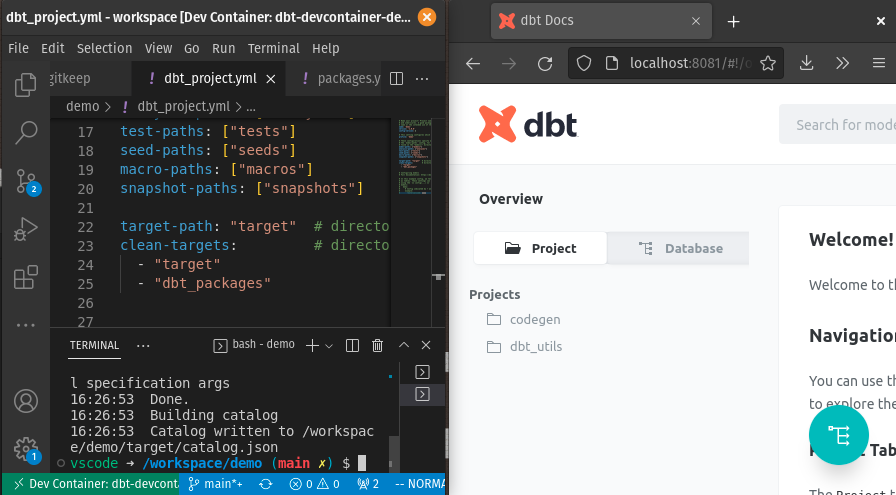

# dbt-devcontainer-demo-template
Template to create self-contained [dev container](https://containers.dev) demos of transforming data with dbt. Useful for interviews.



## Setup

1.  [Install Docker](https://docs.docker.com/engine/install/).
2.  [Install VS Code](https://code.visualstudio.com/Download) and [install the Dev Containers extension](https://marketplace.visualstudio.com/items?itemName=ms-vscode-remote.remote-containers).
3.  [Open this folder in a container](https://code.visualstudio.com/docs/devcontainers/containers#_quick-start-open-an-existing-folder-in-a-container) in VS Code.
4.  Open a [VS Code terminal](https://code.visualstudio.com/docs/terminal/basics). You should see the following prompt:
    ```
    vscode ➜ /workspace (main) $
    ```
    If you see it, you're now in a development container with dbt pre-installed and pre-configured!


## Usage

1.  Copy your CSV file into `seeds/` to use it as a [dbt seed](https://docs.getdbt.com/docs/build/seeds).
2.  Run `dbt seed`
3.  Generate dbt schema for your seed using the following command (be sure to replace "test" with the basename of your CSV file):
    ```
    dbt run-operation generate_model_yaml --args '{"model_name": "test"}'
    ```
    Copy and paste the output to a new file `seeds/schema.yml`, replacing 'models:' with 'seeds:'.
    Re-generate the docs with `dbt docs generate` and you should now be able to see your source declaration when you refresh http://localhost:8081
4.  Code your transformations as usual. Some useful references:
    - [dbt Labs recommended project structure](https://docs.getdbt.com/guides/best-practices/how-we-structure/1-guide-overview)
    - [dbt Labs recommended SQL style guide](https://github.com/dbt-labs/corp/blob/main/dbt_style_guide.md)
5.  To update docs, run `dbt docs generate`. The updated documentation will be available on refresh at http://localhost:8081.
6.  Run the transformations with `dbt run` and tests with `dbt test` as usual.
7.  Query your table data in Adminer at http://localhost:8080. Choose "PostgreSQL" as the system, leave "warehouse" as the server, and enter "postgres" as both the username and password.

## Credits

Based on Microsoft's [python3-postgres](https://github.com/microsoft/vscode-dev-containers/tree/main/containers/python-3-postgres) example.